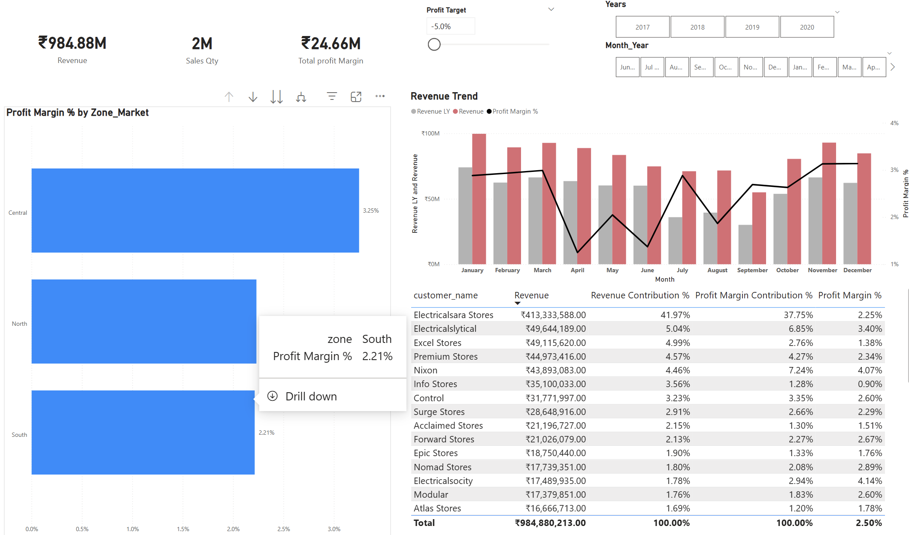
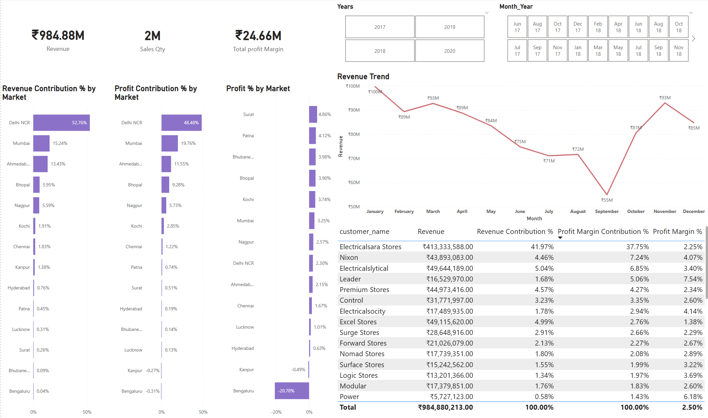

# 📊 Sales Insights – AtliQ Hardware (Power BI | SQL)

## 🔍 Project Overview
This project focuses on building a Sales Insights dashboard for AtliQ Hardware (Brick & Mortar business) to help stakeholders understand sales performance and trends.

The dashboard enables data-driven decision-making and aims to improve revenue and profitability.

---

## 🎯 Objectives
- Analyze sales trends across regions and customers  
- Identify top-performing and underperforming products  
- Track revenue, profit, and quantity sold  
- Provide actionable insights to business users  

---

## 🛠 Tools & Technologies
- Power BI  
- SQL  
- Microsoft Excel  

---

## 📂 Dataset
Sales, customers, products, and markets data sourced from company transactional databases.

---

## 📈 Key Features
- Interactive Power BI dashboard  
- Drill-down analysis by market, product, and customer  
- KPIs for Revenue, Profit Margin, and Sales Quantity  
- Time-based trend analysis  

---

## 🧠 Insights Generated
- Identified high-revenue markets and customers  
- Detected low-profit regions requiring attention  
- Helped management take actions to increase revenue by ~7% in the next quarter  

---

## 🖼 Dashboard Preview

### Key Insights

### Performance Insights

### Profit Analysis

---

## 🚀 How to Use
1. Download the `.pbix` file  
2. Open using Power BI Desktop  
3. Refresh data if required  

---

## 📌 Author
**Yuvraj Gupta**  

---

## ⭐ If you like this project, feel free to star the repository!
